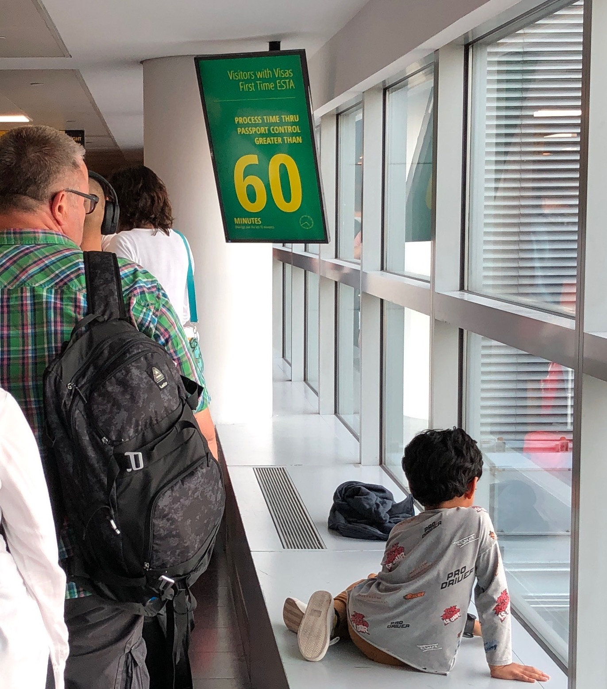
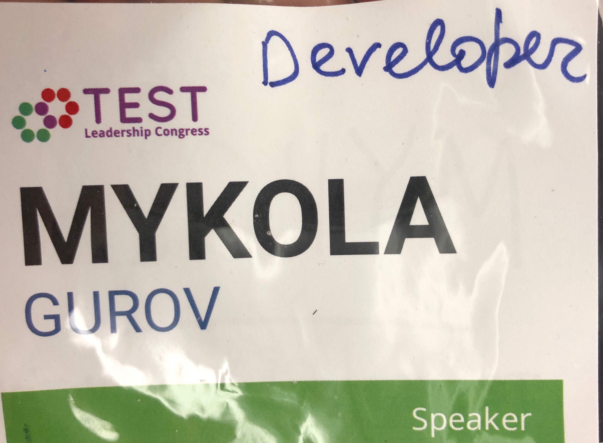

A cozy small-scale event in the heart of New York. Leadership, software quality, testing. Great friendly atmosphere you'll want to enjoy once more.

<!--more-->

When [my talk](/talks/testing-on-production/) got selected for [Test Leadership Congress NYC 2019](https://testleadershipcongress-ny.com), I got some rather mixed feedback form my peers: "Sure, great, but a testing conference - is it something really interesting for you to spend time on? Wasn't you the one of the first who said your team doesn't need a tester, after all?". To give the context, testing (and development as a whole) has been transformed radically for the last 5 years at bol, and the word "testing" has a connotation of the tedious activity that used to be happening every now and then in the old good age of synchronized infrequent monolith deployments.

Even if we don't have dedicated professionals busy with an explicit "testing" phase, we still do care about the quality, have some (implicit or explicit) testing strategy – was my argument. Besides, this is a congress, a leadership one, and in New York – and I haven't been there yet!

I checked with @ivo and @joost who paved the way to this event a couple of years ago. "It's a small conference. You'll like it, it's nice." – was my impression.

Three months later, here I am in a crowded corridor with an indication that I should give up on hope to be released soon.

Two hours forward and I am making a clumsy attempt to shot the iconic NY sunset. 

The first day of the congress was the workshop day. Workshops, especially those where you have to work in small groups, are a great way to blend in for people like me (reserved introverts). I particularly liked the session by [Anders Dinsen](https://testleadershipcongress2019.sched.com/speaker/andersdinsen) and [Ole S Rasmussen](https://testleadershipcongress2019.sched.com/speaker/ole8) where participants were provoked to jump and act various, sometimes contradictory, roles in situations from their experience. 

Soon I realized I was of the very few (if not the only) active developer at the conference: 

the fact to which I did have to adjust in conversations. It was a good vibe and everything. 

### TODO

[ ] top image from test leadership congress